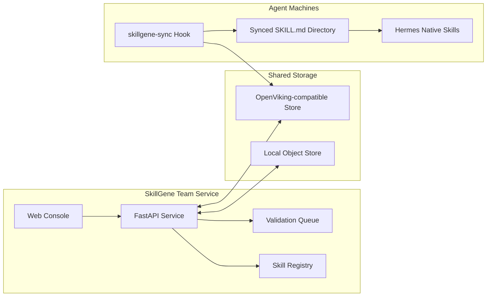
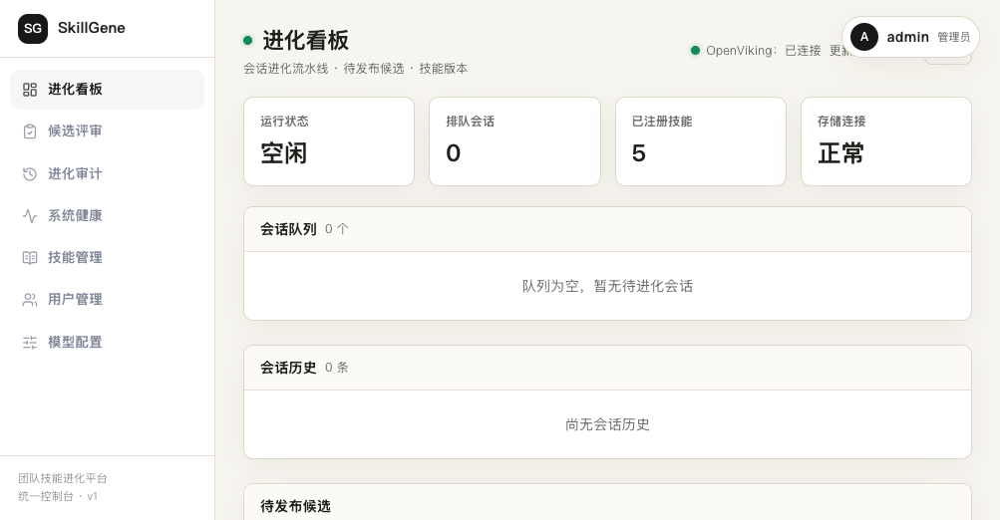
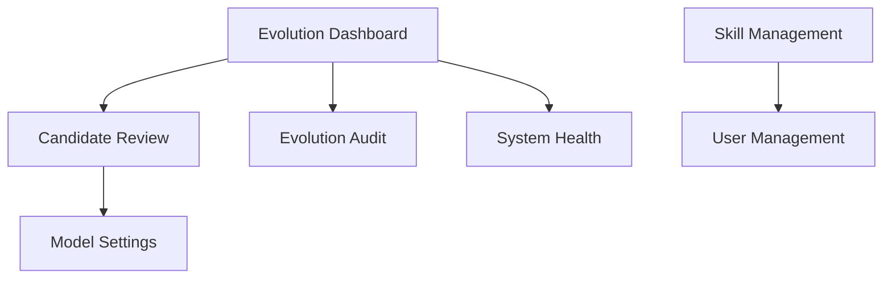
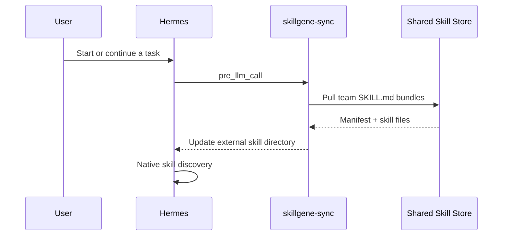
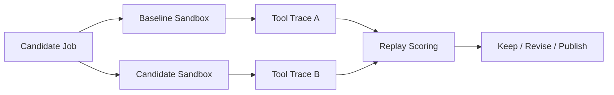

# SkillGene

<div align="center">

## A Skill Library, Sync Console, and Validation Workbench for Agent Teams

[](https://www.python.org/)
[](https://fastapi.tiangolo.com/)
[](https://react.dev/)
[](./LICENSE)
[](./README.md)

**Turn real agent experience into reusable, synced, auditable `SKILL.md` assets for your team.**

</div>

---

## Why SkillGene?

Agents can already complete complex tasks, but team skills often remain a loose set of files on one machine:

- **Hard to share**: the same experience gets copied across members, machines, and agents.
- **Hard to version**: it is unclear who changed a skill, what changed, and which version is live.
- **Hard to trust**: a skill may look polished, but there is little evidence that it improves task outcomes.
- **Easy to over-instrument**: proxying model requests can break native agent behavior and makes open deployment harder.

**SkillGene has a deliberate boundary: it does not proxy model traffic. It manages, syncs, and validates skill assets.**
Hermes and other agents keep using their own model configuration directly. SkillGene delivers team skills through synced directories and hooks, so the agent's native skill system remains in control.

---

## Core Capabilities

<table>
  <tr>
    <td width="25%" valign="top">
      <h3>Skill Library</h3>
      <p>Read, create, edit, delete, package, and import standard <code>SKILL.md</code> bundles while preserving frontmatter and attachments.</p>
    </td>
    <td width="25%" valign="top">
      <h3>Team Sync</h3>
      <p>Use local object storage or OpenViking-compatible object storage with separate personal and team spaces.</p>
    </td>
    <td width="25%" valign="top">
      <h3>Web Console</h3>
      <p>A built-in React + TypeScript console for skills, users, candidate review, health checks, and model settings.</p>
    </td>
    <td width="25%" valign="top">
      <h3>True Replay</h3>
      <p>Run baseline and candidate branches in isolated sandboxes and validate skill changes with real tool trajectories.</p>
    </td>
  </tr>
</table>

---

## Architecture



The recommended path is shared storage, local sync, and native agent loading. Commands such as `skills_list`, `skill_view`, and `/skills` continue to come from the agent itself; SkillGene only makes sure the team skill library reaches the machine reliably.

---

## Quick Start

### 1. Install

```bash
git clone https://github.com/leoriczhang/skillgene.git
cd skillgene
python -m venv .venv
source .venv/bin/activate
python -m pip install -U pip
python -m pip install -e ".[all]"
```

Core package only:

```bash
python -m pip install -e .
```

Installer script:

```bash
bash scripts/install_skillgene.sh
```

### 2. Configure a Local Skill Library

```bash
skillgene config skills.enabled true
skillgene config skills.dir ./skills
skillgene config sharing.enabled true
skillgene config sharing.backend local
skillgene config sharing.local_root ./skillgene-store
```

### 3. Create a Skill

```bash
mkdir -p skills/example-skill
cat > skills/example-skill/SKILL.md <<'EOF'
---
name: example-skill
description: Use when you need a minimal SkillGene example.
category: general
---

# Example Skill

Follow the project conventions and keep the answer concise.
EOF
```

### 4. Sync Skills

```bash
skillgene skills push
skillgene skills list-remote
skillgene skills pull
```

### 5. Start the Console

```bash
skillgene config service.port 30000
skillgene start --daemon
skillgene status
```

Open:

```text
http://127.0.0.1:30000/console
```

On first launch, initialize the admin account. The default username and password are both `admin`; change them after deployment.

---

## Console Map

<div align="center">
  
  <br>
  <sub>SkillGene Console: evolution dashboard, team skill status, storage connectivity, and management entry points.</sub>
</div>



The console includes:

- **Evolution Dashboard**: storage connectivity, skill count, candidate queue, and service status.
- **Candidate Review**: inspect candidate skills before publication, with optional True Replay validation.
- **Evolution Audit**: review skill-evolution records.
- **System Health**: check service, storage, and key API availability.
- **Skill Management**: manage personal and team skills, including zip upload.
- **User Management**: manage users, roles, and personal/team storage credentials.
- **Model Settings**: configure an optional validation model and test connectivity.

---

## Team Skill Sync

SkillGene is no longer an OpenAI-compatible model proxy. `/v1/models` and `/v1/chat/completions` return 404.
Install `skillgene-sync` on agent machines instead. It pulls team skills before each LLM call and adds the synced directory to the agent's external skill directories.



Install example:

```bash
python skillgene/integrations/hermes_skill_sync/install.py \
  --viking-endpoint "https://<your-openviking-endpoint>" \
  --viking-team-api-key "<team-key>" \
  --viking-root-prefix "skillgene"
```

The installer writes configuration similar to:

```yaml
skills:
  external_dirs:
    - <HERMES_HOME>/team_skills/skillgene
hooks:
  pre_llm_call:
    - command: "python3 <HERMES_HOME>/skills/skillgene-sync/sync_skills.py"
      timeout: 60
```

If the agent is already running, execute `/reload-skills` to refresh the current session cache. New sessions pick up synced skills automatically.

### Session Skill Attribution and Efficiency Metrics

The `skillgene-feed` `on_session_end` hook reads the complete Hermes trajectory
from `state.db`. System, user, assistant, and tool messages are retained:

- `injected_skills`: skills actually exposed in the system prompt's `<available_skills>` block.
- `used_skills`: skills actually loaded through `skill_view`.
- `metrics`: interaction turns, tool-call count, and input/output/cache/reasoning tokens.

After installing `skillgene-feed`, these fields are sent through `/ingest_session`
and preserved in the session archive and console details.

---

## OpenViking / Object Storage

Remote sync uses SkillGene's object-store abstraction. Example OpenViking-compatible configuration:

```bash
skillgene config sharing.enabled true
skillgene config sharing.backend viking
skillgene config sharing.viking_endpoint "https://<your-openviking-endpoint>"
skillgene config sharing.viking_team_api_key "<team-key>"
skillgene config sharing.viking_personal_api_key "<personal-key>"
skillgene config sharing.viking_root_prefix "skillgene"
```

Do not commit real API keys. Use local configuration, environment variables, or your deployment platform's secret manager.

---

## True Replay: Validate Skills with Real Trajectories

Plain-text A/B checks can only compare answers. True Replay starts real agents in isolated environments and runs baseline and candidate branches. If a task is incomplete, judge feedback becomes the next user message in the same session. The primary comparison dimensions are:

1. User/agent interaction turns needed to complete the task; fewer is better.
2. Tool-call count; fewer calls usually indicate a more direct execution path.
3. Total tokens, with input/output/cache/reasoning details retained.



Install dependencies:

```bash
python -m pip install -e ".[truereplay]"
```

Replay a shared validation job:

```bash
python -m skillgene.true_replay --job-id <validation-job-id> --json
```

Replay a local JSON job file:

```bash
python -m skillgene.true_replay --job-file ./candidate_job.json --dry-run
python -m skillgene.true_replay --job-file ./candidate_job.json --json
```

True Replay creates temporary `HOME` and `HERMES_HOME` directories for both branches and does not modify your real agent configuration. To use a local agent checkout, set `HERMES_ORIGIN`.

---

## Project Layout

```text
skillgene/
├── skillgene/
│   ├── cli/              # skillgene command line
│   ├── config_store/     # local config store
│   ├── proxy/            # service routes, console, and admin APIs
│   ├── skills/           # SKILL.md management, bundling, sync
│   ├── storage/          # local / OpenViking storage backends
│   ├── integrations/     # Hermes integration
│   ├── validation/       # optional candidate-skill validation
│   ├── true_replay.py    # true A/B replay
│   └── web/              # built console assets
├── web-ui/               # React + TypeScript console source
├── tests/
├── scripts/
└── pyproject.toml
```

---

## Development

```bash
python -m pip install -e ".[dev,all]"
python -m pytest
```

Build the console and Python package:

```bash
npm --prefix web-ui install
npm --prefix web-ui run build
python -m pip install build
python -m build
```

---

## References

This README borrows its product-documentation structure from [OpenSpace](https://github.com/HKUDS/OpenSpace): centered hero, badges, value cards, architecture diagrams, quality-loop narrative, and a clear usage path.
Technically, SkillGene focuses on standard `SKILL.md` assets, native agent skill loading, team object-store sync, and optional real-trajectory validation.

Related projects and references:

- [OpenSpace](https://github.com/HKUDS/OpenSpace): a quality-first skill hub for AI agents.
- [Hermes Agent](https://github.com/nousresearch/hermes-agent): optional runtime dependency for True Replay.
- [FastAPI](https://fastapi.tiangolo.com/): the SkillGene service framework.
- [React](https://react.dev/) and [TypeScript](https://www.typescriptlang.org/): the SkillGene console stack.

---

## License

MIT
