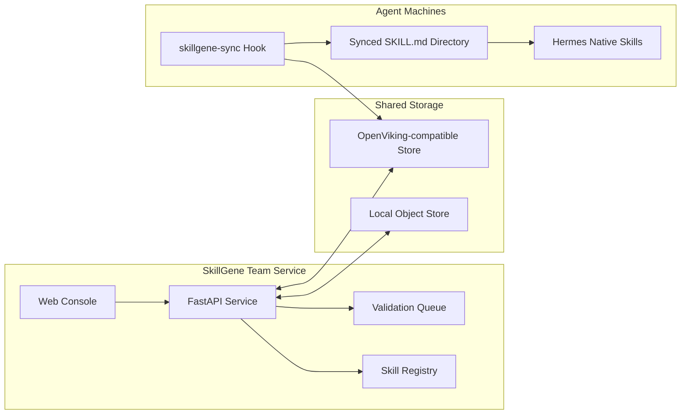
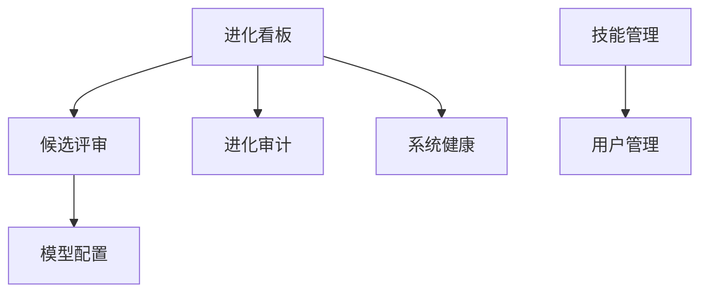
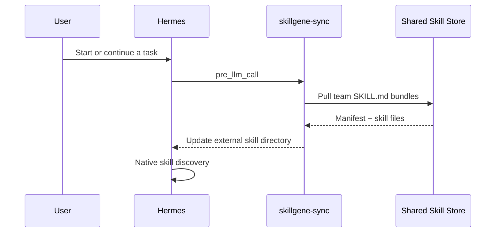
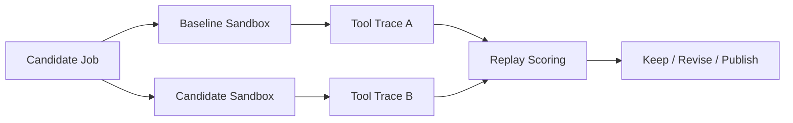

# SkillGene

<div align="center">

## 面向 Agent 团队的技能库、同步控制台与验证工作台

[](https://www.python.org/)
[](https://fastapi.tiangolo.com/)
[](https://react.dev/)
[](./LICENSE)
[](./README.en.md)

**把真实 Agent 使用经验沉淀为可复用、可同步、可审计的 `SKILL.md` 团队资产。**

</div>

---

## 为什么需要 SkillGene？

Agent 已经能完成复杂任务，但团队技能通常还停留在“某台机器上的一组文件”：

- **技能难共享**：同一条经验在不同成员、不同机器、不同 Agent 里反复复制。
- **版本难追踪**：技能改过什么、谁上传的、当前团队空间里是哪一版，很难回答。
- **质量难判断**：一个技能看起来写得很好，但是否真的改善任务结果，缺少证据。
- **接入易侵入**：通过代理劫持模型请求会破坏 Agent 原生能力，也不利于开源部署。

**SkillGene 的边界很清晰：它不代理模型请求，而是管理、同步和验证技能资产。**
Hermes 等 Agent 继续直连自己的模型服务；SkillGene 通过同步目录和 Hook 把团队技能带到 Agent 原生技能系统里。

---

## 核心能力

<table>
  <tr>
    <td width="25%" valign="top">
      <h3>技能库管理</h3>
      <p>读取、创建、编辑、删除、打包和导入标准 <code>SKILL.md</code> 技能，保留 frontmatter 与附件目录。</p>
    </td>
    <td width="25%" valign="top">
      <h3>团队同步</h3>
      <p>支持本地对象存储和 OpenViking 兼容对象存储，可区分个人空间与团队空间。</p>
    </td>
    <td width="25%" valign="top">
      <h3>Web 控制台</h3>
      <p>内置 React + TypeScript 控制台，覆盖技能管理、用户管理、候选评审、健康检查和模型配置。</p>
    </td>
    <td width="25%" valign="top">
      <h3>真实回放</h3>
      <p>True Replay 在隔离沙盒中运行 baseline 与 candidate 分支，用真实工具轨迹评估候选技能。</p>
    </td>
  </tr>
</table>

---

## 系统图



SkillGene 的推荐链路是“共享存储 + 本地同步 + Agent 原生加载”。这样 `skills_list`、`skill_view`、`/skills` 等能力仍由 Agent 自己提供，SkillGene 只负责把团队技能可靠送到本机。

---

## 快速开始

### 1. 安装

```bash
git clone https://github.com/leoriczhang/skillgene.git
cd skillgene
python -m venv .venv
source .venv/bin/activate
python -m pip install -U pip
python -m pip install -e ".[all]"
```

只安装核心能力：

```bash
python -m pip install -e .
```

也可以使用安装脚本：

```bash
bash scripts/install_skillgene.sh
```

### 2. 配置本地技能库

```bash
skillgene config skills.enabled true
skillgene config skills.dir ./skills
skillgene config sharing.enabled true
skillgene config sharing.backend local
skillgene config sharing.local_root ./skillgene-store
```

### 3. 创建一个技能

```bash
mkdir -p skills/example-skill
cat > skills/example-skill/SKILL.md <<'EOF'
---
name: example-skill
description: Use when you need a minimal SkillGene example.
category: general
---

# Example Skill

Follow the project conventions and keep the answer concise.
EOF
```

### 4. 同步技能

```bash
skillgene skills push
skillgene skills list-remote
skillgene skills pull
```

### 5. 启动控制台

```bash
skillgene config service.port 30000
skillgene start --daemon
skillgene status
```

打开：

```text
http://127.0.0.1:30000/console
```

首次启动时可初始化管理员账号。默认账号与密码均为 `admin`，建议部署后立即修改。

---

## 控制台概览

<div align="center">
  
  <br>
  <sub>SkillGene 控制台：进化看板、团队技能状态、存储连通性与管理入口。</sub>
</div>



控制台内置以下页面：

- **进化看板**：查看存储连通性、技能数量、候选队列和系统状态。
- **候选评审**：检查待验证候选技能，配合 True Replay 做发布前评估。
- **进化审计**：查看技能演进相关记录。
- **系统健康**：检查服务、存储和关键 API 是否可达。
- **技能管理**：管理个人技能与团队技能，支持上传 zip 包。
- **用户管理**：管理用户、角色，以及个人/团队空间凭据。
- **模型配置**：配置可选验证模型，并提供连通性测试。

---

## 团队技能同步

SkillGene 不再作为 OpenAI 兼容模型代理使用。`/v1/models` 与 `/v1/chat/completions` 会返回 404。
推荐在 Agent 机器上安装 `skillgene-sync`，在每次 LLM 调用前拉取团队技能，并把同步目录加入 Agent 的外部技能目录。



安装示例：

```bash
python skillgene/integrations/hermes_skill_sync/install.py \
  --viking-endpoint "https://<your-openviking-endpoint>" \
  --viking-team-api-key "<team-key>" \
  --viking-root-prefix "skillgene"
```

安装脚本会写入类似配置：

```yaml
skills:
  external_dirs:
    - <HERMES_HOME>/team_skills/skillgene
hooks:
  pre_llm_call:
    - command: "python3 <HERMES_HOME>/skills/skillgene-sync/sync_skills.py"
      timeout: 60
```

如果 Agent 已经在运行，执行 `/reload-skills` 刷新当前会话缓存；新会话会自动读取同步后的技能。

### 会话技能归因与效率指标

`skillgene-feed` 的 `on_session_end` hook 会从 Hermes `state.db` 上传完整轨迹，
保留 system、user、assistant、tool 消息，不再丢弃工具调用和工具结果：

- `injected_skills`：system prompt 的 `<available_skills>` 中实际暴露的技能。
- `used_skills`：本次对话实际通过 `skill_view` 加载的技能。
- `metrics`：交互轮次、工具调用次数，以及 input/output/cache/reasoning tokens。

安装 `skillgene-feed` 后，这些字段会随 `/ingest_session` 一起进入会话归档和控制台详情。

---

## OpenViking / 对象存储

远端同步通过对象存储抽象完成。OpenViking 兼容配置示例：

```bash
skillgene config sharing.enabled true
skillgene config sharing.backend viking
skillgene config sharing.viking_endpoint "https://<your-openviking-endpoint>"
skillgene config sharing.viking_team_api_key "<team-key>"
skillgene config sharing.viking_personal_api_key "<personal-key>"
skillgene config sharing.viking_root_prefix "skillgene"
```

不要把真实 API Key 写入仓库。建议使用本机配置、环境变量或部署系统的 Secret 管理能力注入。

---

## True Replay：用真实轨迹验证技能

普通文本 A/B 只能判断回答像不像；True Replay 会在隔离环境中启动真实 Agent，对 baseline 和 candidate 两个分支分别执行任务。任务未完成时，裁判反馈会作为下一轮用户消息在同一 session 中继续交互。最终优先比较：

1. 达成任务所需的交互轮次，越少越好。
2. 工具调用次数，越少通常说明执行路径越直接。
3. Total tokens，并同时保留 input/output/cache/reasoning token 明细。



安装依赖：

```bash
python -m pip install -e ".[truereplay]"
```

从验证队列回放：

```bash
python -m skillgene.true_replay --job-id <validation-job-id> --json
```

使用本地 JSON 文件独立回放：

```bash
python -m skillgene.true_replay --job-file ./candidate_job.json --dry-run
python -m skillgene.true_replay --job-file ./candidate_job.json --json
```

True Replay 会为两条分支创建临时 `HOME` 与 `HERMES_HOME`，不会修改真实 Agent 配置。若使用本地 Agent checkout，可通过 `HERMES_ORIGIN` 指定源码位置。

---

## 项目结构

```text
skillgene/
├── skillgene/
│   ├── cli/              # skillgene 命令行
│   ├── config_store/     # 本地配置读写
│   ├── proxy/            # 服务路由、控制台和管理接口
│   ├── skills/           # SKILL.md 管理、打包、同步
│   ├── storage/          # local / OpenViking 存储后端
│   ├── integrations/     # Hermes 集成
│   ├── validation/       # 可选候选技能验证
│   ├── true_replay.py    # 真实 A/B 回放
│   └── web/              # 控制台构建产物
├── web-ui/               # React + TypeScript 控制台源码
├── tests/
├── scripts/
└── pyproject.toml
```

---

## 开发

```bash
python -m pip install -e ".[dev,all]"
python -m pytest
```

构建前端与 Python 包：

```bash
npm --prefix web-ui install
npm --prefix web-ui run build
python -m pip install build
python -m build
```

---

## 参考与引用

相关项目与资料：

- [OpenSpace](https://github.com/HKUDS/OpenSpace)：质量优先的 Agent Skill Hub。
- [Hermes Agent](https://github.com/nousresearch/hermes-agent)：可选 True Replay 运行时依赖。
- [FastAPI](https://fastapi.tiangolo.com/)：SkillGene 服务端框架。
- [React](https://react.dev/) 与 [TypeScript](https://www.typescriptlang.org/)：SkillGene 控制台技术栈。

---

## License

MIT
